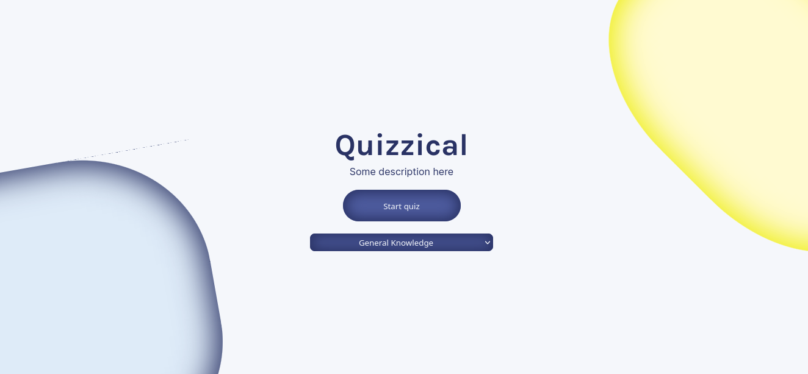
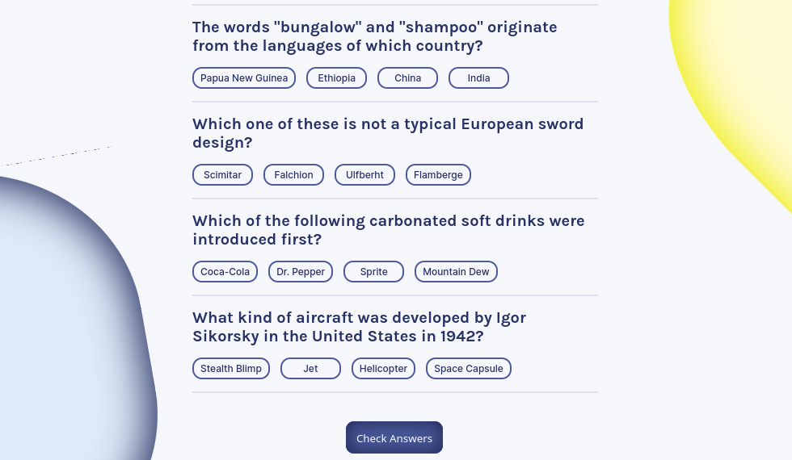
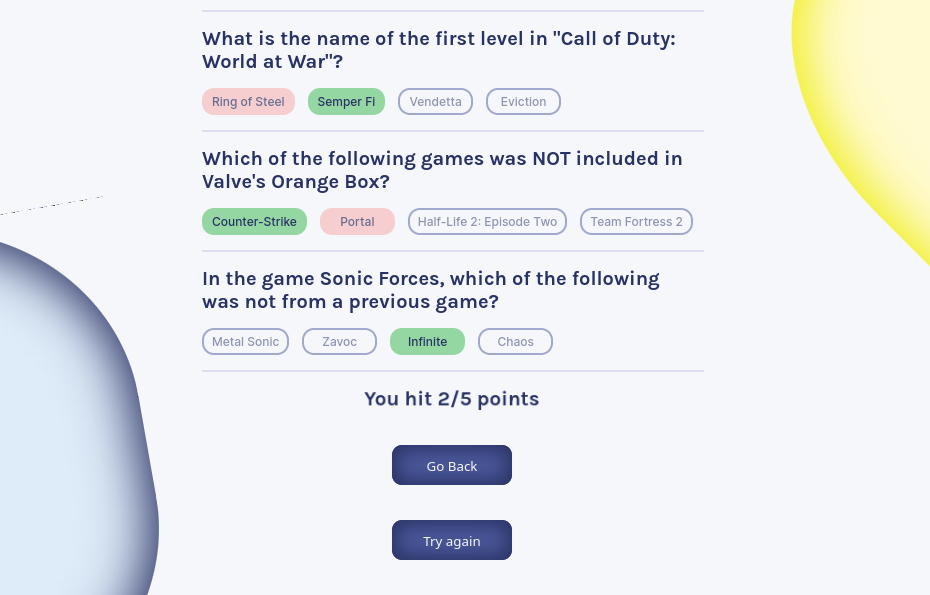

# React Quiz App

<a href='https://celorocha.github.io/react-quiz-app/' target='_blank'>See Online</a>

## Conhecimentos demonstrados:

-	Javascript;
-	CSS;
-	HTML (JSX);
-	ReactJS;
-	Utilização de API (Open Trivia DB);

---

## O site:
### Home

É possível selecionar a categoria e iniciar o quiz.

---

### Quiz:

Ao iniciar o jogo, cinco questões serão buscadas em uma API, retornadas e expostas na tela, de acordo com a categoria selecionada, não é possível enviar a resposta até que todas elas tenham uma alternativa marcada.

---

### Quiz finalizado:

Ao finalizar o quiz, seus acertos serão contabilizados, e as respostas corretas serão sinalizadas. É possível voltar a homepage ou buscar 5 novas questões da mesma categoria.